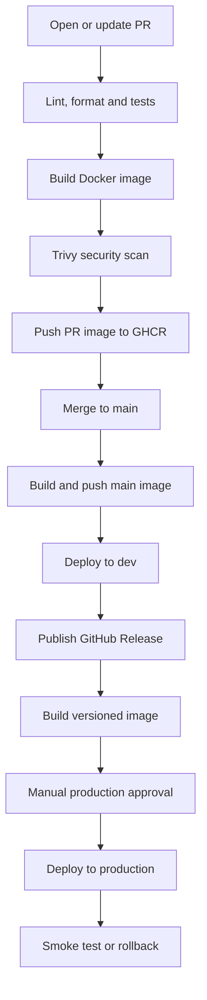

# Cloud DevOps CI/CD Demo

[](https://github.com/aalizadacloud-ops/cloud-devops-pr/actions/workflows/ci.yml)
[](https://github.com/aalizadacloud-ops/cloud-devops-pr/actions/workflows/release.yml)

A small FastAPI application demonstrating a complete CI/CD lifecycle with `uv`, Docker, GitHub Actions, GHCR, GitHub Environments, and GitHub Releases.

## Application

| Endpoint | Purpose |
|---|---|
| `GET /` | Returns the application message and version |
| `GET /health` | Returns `{"status": "healthy"}` |

## Pipeline overview



## Pull request workflow

The CI workflow runs when a pull request targeting `main` is opened, updated, or reopened.

It performs:

1. Repository checkout
2. Python and `uv` setup
3. Locked dependency installation
4. Ruff lint check
5. Ruff format check
6. pytest unit tests
7. Docker image build
8. Trivy vulnerability scan
9. GHCR image push

Example tags:

```text
ghcr.io/aalizadacloud-ops/cloud-devops-pr:pr-3
ghcr.io/aalizadacloud-ops/cloud-devops-pr:sha-c2e625d
```

## Main branch and dev deployment

After a pull request is merged into `main`, the workflow runs again and:

1. Repeats the quality and security checks
2. Pushes `main` and commit-SHA image tags
3. Uses the GitHub `dev` Environment
4. Runs a mocked dev deployment
5. Runs a mocked smoke test

## Release and production deployment

Publishing a GitHub Release such as `v1.0.0` triggers the production workflow.

It:

1. Checks out the exact release tag
2. Installs locked dependencies with `uv`
3. Runs unit tests
4. Validates the semantic-version tag
5. Builds and scans the release image
6. Pushes `v1.0.0` and `latest` to GHCR
7. Waits for approval through the protected `prod` Environment
8. Runs a mocked production deployment
9. Runs a mocked smoke test
10. Runs a mocked rollback if deployment fails

## Environment separation

| Environment | Trigger | Image tag | Approval |
|---|---|---|---|
| PR validation | Pull request | `pr-<number>` | No |
| Development | Merge to `main` | `main` | No |
| Production | Published release | `v1.0.0` | Required |

## Real and mocked components

| Component | Implementation |
|---|---|
| FastAPI application | Real |
| `uv` dependency management | Real |
| Ruff checks | Real |
| pytest tests | Real |
| Docker build | Real |
| Trivy scan | Real |
| GHCR publishing | Real |
| GitHub Environments | Real |
| Production approval | Real |
| Dev deployment | Mocked |
| Production deployment | Mocked |
| Smoke tests | Mocked |
| Rollback | Mocked |

The deployment operations are mocked because this assignment does not require a cloud account. In a real environment, the `echo` commands could be replaced with Helm, Kubernetes, Argo CD, AWS, Azure, or GCP deployment commands.

## Running locally

Requirements:

- Git
- `uv`
- Docker

Clone and install:

```bash
git clone https://github.com/aalizadacloud-ops/cloud-devops-pr.git
cd cloud-devops-pr
uv sync --locked
```

Run the application:

```bash
uv run cloud-devops-pr
```

Test it:

```bash
curl http://localhost:8000/
curl http://localhost:8000/health
```

## Running quality checks

```bash
uv run ruff check .
uv run ruff format --check .
uv run pytest
```

## Running with Docker

```bash
docker build -t cloud-devops-pr:local .
docker run --rm -p 8000:8000 cloud-devops-pr:local
```

## Testing a change through a pull request

```bash
git switch -c feature/example-change
git add .
git commit -m "Describe the change"
git push -u origin feature/example-change
```

Open a pull request against `main` and wait for the quality and container jobs to pass.

GHCR publishing is skipped for pull requests from external forks because forked workflows receive restricted tokens. Same-repository PRs push the required `pr-<number>` image.

## Creating a production release

Production releases should be created from a verified `main` branch:

```bash
gh release create v1.0.0 \
  --target main \
  --title "v1.0.0" \
  --notes "Initial production release."
```

When the release image is ready:

1. Open the waiting workflow run.
2. Select **Review deployments**.
3. Select the `prod` Environment.
4. Add an approval comment.
5. Select **Approve and deploy**.

## Image tags

| Event | Tags |
|---|---|
| Pull request | `pr-<number>`, `sha-<short-sha>` |
| Push to `main` | `main`, `sha-<short-sha>` |
| Release | `v1.0.0`, `latest` |

Version and SHA tags provide traceability and make rollback to a previous image possible.

## Assumptions and trade-offs

- The repository is public and uses free GitHub-hosted runners.
- No cloud-provider account is required.
- The workflows use the temporary `GITHUB_TOKEN`; no registry password is stored.
- Dependencies are reproducible through `uv.lock`.
- The Docker application runs as a non-root user.
- Trivy reports `HIGH` and `CRITICAL` vulnerabilities.
- Trivy is non-blocking with `exit-code: "0"` so findings remain visible without making the demonstration unstable. A production pipeline should define a blocking vulnerability policy and documented exceptions.
- Images are built once for scanning and again for publishing. A production pipeline could instead promote the same verified image by immutable digest.
- Rollback is conditional and mocked because there is no real deployment target.

## Project structure

```text
.
├── .github/
│   └── workflows/
│       ├── ci.yml
│       └── release.yml
├── src/
│   └── cloud_devops_pr/
│       └── __init__.py
├── tests/
│   └── test_app.py
├── .dockerignore
├── Dockerfile
├── pyproject.toml
├── README.md
└── uv.lock
```